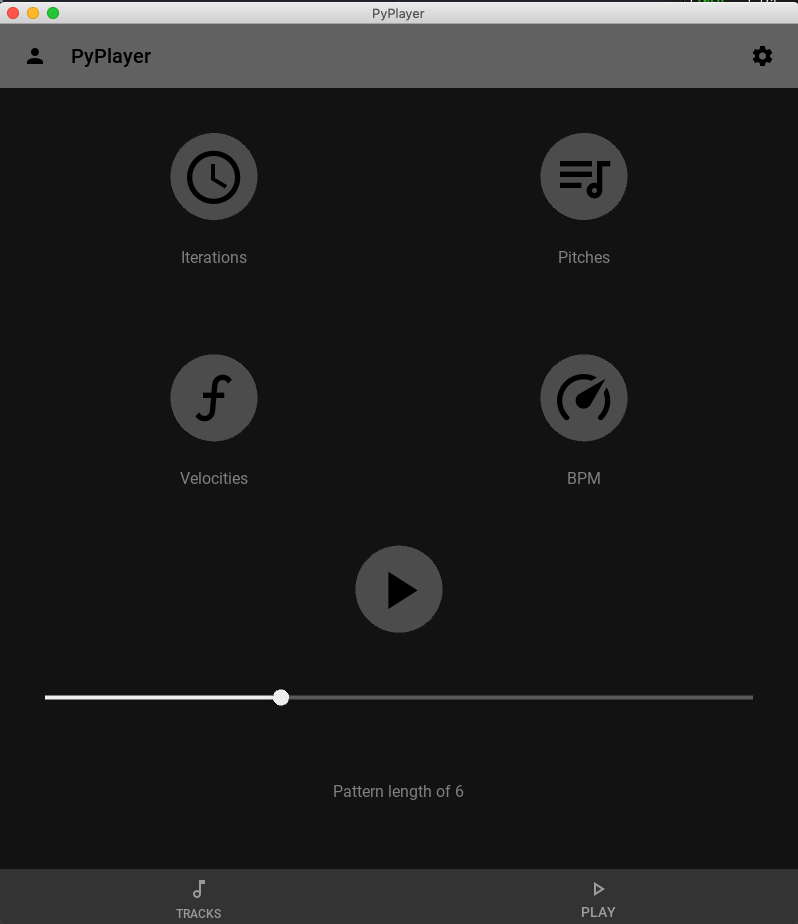

# p y p l a y e r
a lightweight (🐍) markov midi sequencer 
> ~200 lines (core functionality)  
> 100% python  
> cross-compatible  
> L O A D S  V E R S I O N  1

https://youtu.be/HrtuPT9xNvA

# C o m p o n e n t s
> ThreadManager will allow for 16 synchronized midi streams. This corresponds to 1 per midi channel  

- kivy: GUI & Threading
  - MidiInterface: High Level Bussing
    - MarkovPlayer: Pattern Generation
      - SleepManager: Quantization & Synchronization    
      - KeyCache: Polyphony Management & On/Off sequencing

### f a s t s t a t s
- generates midi notes on the <b><i>BUS</i></b>
- compatible with Linux, Windows, MacOS
  - Future compatibility with iOS & Android
- kivy GUI
  - up to 16 MidiInterfaces per GUI
    - 1 MarkovPlayer per MidiInterface
      - 1 SleepManager injected into the MarkovPlayer
      - 1 KeyCache injected into the MarkovPlayer

## i n s t a l l  

<i> m a c o s </i>
<code>
git clone https://github.com/jaquielajoie/pyplayer.git | cd pyplayer
</code>  
 
<code>
python3 -m venv .venv  |  
source .venv/bin/activate  |  
pip -r requirements.txt  
</code>  

## r u n
- found inside of /src/ folder
- venv must be activated
- dependencies must be installed

<b>...Starting after the end of the install step...</b>    
<code>
cd src
</code>

<code>
python gui.py
</code>

# G U I

### v2

### v1

- new midi files can be selected once all notes have been played
- improved threading will allow interaction while notes are being transmitted

# B u s s i n g 🚌   🚌🚌   🚌🚌🚌
- "IAC Driver Bus 1" is set as the default midi bus (MAC compatible)
- rtmidi is used as the mido backend
- these must be changed in the code manually at the moment

