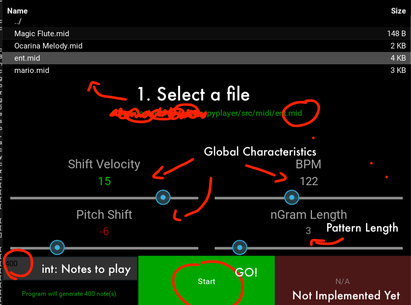

# p y p l a y e r
a lightweight markov midi sequencer for the people
> ~200 lines (core functionality)

https://youtu.be/HrtuPT9xNvA

# C o m p o n e n t s
> ThreadManager will allow for 16 synchronized midi streams. This corresponds to 1 per midi channel  

- Kivy App: GUI
  - ThreadManager: ThreadPoolExecutor
    - MidiInterface: High Level Bussing
      - SleepManager: Quantization & Synchronization
      - MarkovPlayer: Pattern Generation
      - KeyCache: Polyphony Management & On/Off sequencing

## i n s t a l l  

<i> m a c o s </i>
<code>
git clone https://github.com/jaquielajoie/pyplayer.git | cd pyplayer
</code>  
 
<code>
python3 -m venv .venv  |  
source .venv/bin/activate  |  
pip -r requirements.txt  
</code>  

## r u n
- found inside of /src/ folder
- venv must be activated
- dependencies must be installed

<b>...Starting after the end of the install step...</b>    
<code>
cd src
</code>

<code>
python gui.py
</code>

# G U I

- new midi files can be selected once all notes have been played
- improved threading will allow interaction while notes are being transmitted

# B u s s i n g 🚌   🚌🚌   🚌🚌🚌
- "IAC Driver Bus 1" is set as the default midi bus (MAC compatible)
- rtmidi is used as the mido backend
- these must be changed in the code manually at the moment

